# TaskFlow

Welcome to the Readme file for TaskFlow, a free customizable Kanban webapp built with [Django](https://www.djangoproject.com/).

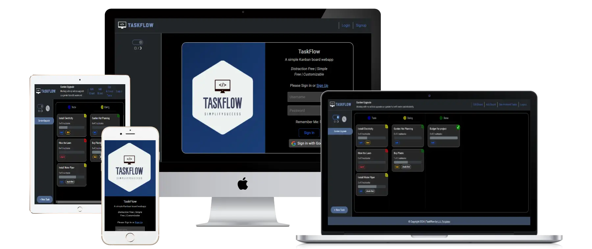

++ **[Link to Live Site](https://task-flow-kanban-00e35d8a382c.herokuapp.com/accounts/login/?next=/)** ++
<br>

**[Link to Github Project Board](https://github.com/users/leonp84/projects/3)**

<hr>

*For testing the application, please use the following login details:*

Username: 	**admin**

Password: 	**taskflow12345**
<hr>

# Table of Contents

1. [Overview](#overview)
2. [UX](#ux)
   - [User Stories](#user-stories)
     - [User](#user)
     - [Site Administrator](#site-administrator)
   - [Site Concept](#site-concept)
   - [Site Design](#site-design)
     - [Visuals](#visuals)
     - [Logo](#logo)
     - [Wireframing](#wireframing)
       - [Desktop](#desktop)
       - [Mobile](#mobile)
3. [Model Design And Relationships](#model-design-and-relationships)
4. [Features](#features)
   - [Summary](#summary)
   - [Accounts](#accounts)
   - [Create New Board](#create-new-board)
   - [Edit Existing Board](#edit-existing-board)
   - [Switch Between Boards](#switch-between-boards)
   - [Create New Tasks](#create-new-tasks)
   - [Create Subtasks](#create-subtasks)
   - [Edit Existing Tasks](#edit-existing-tasks)
   - [Archive Tasks](#archive-tasks)
   - [View Archived Tasks](#view-archived-tasks)
   - [Delete Tasks](#delete-tasks)
   - [Search Tasks](#search-tasks)
   - [Theme Toggle](#theme-toggle)
   - [Statistics](#statistics)
5. [Testing](#testing)
   - [Manual Testing](#manual-testing)
   - [Automated Testing](#automated-testing)
   - [Validator Testing](#validator-testing)
   - [Lighthouse Testing](#lighthouse-testing)
6. [Bugs](#bugs)
7. [Deployment](#deployment)
8. [Links](#links)
9. [Credits](#credits)
   - [Content](#content)
   - [Media](#media)


# Overview

TaskFlow is a free, customizable and distraction free Kanban Web application that allows users to keep track of tasks related to a professional or personal project. The app has a minimalistic visual design with build in theme toggle, and allows users to customize their Kanban boards, columns and tasks as needed. 

The app is fully responsive across all screen sizes, with the main design breakpoint at portrait tablet size (768px). By nature of its contents – a multi column board with tasks and drag and drop functionality – users will find the app works best on the larger screens of laptops or desktops, even though smaller screens have nearly all the functionality of its larger counterparts.


# UX

## User Stories

### User

User Story cards can be viewed on the [Github Project Board](https://github.com/users/leonp84/projects/3)

<details>
<summary> User Stories </summary>
<br>

> #2 As a site user I can create a new account so that I can use the Kanban app.

> #5 As a site user I can log in, and log out to have my personalised data displayed.

> #7 As a site user I can create a new empty Kanban board to set up my productivity system.

> #8 As a site user I can add new empty columns to my board to customize my project.

> #9 As a site user I can create custom labels to use with my board to suit my project needs.

> #10 As a site user, I can edit existing boards to remain flexible with project changes.

> #11 As a site user, I can create new tasks within a board to keep track of my todos.

> #12 As a site user, I can add subtasks to individual tasks to further break down what needs to be done.

> #13 As a site user, I can add labels to individual tasks to customize my tasks.

> #14 As a site user, I can update existing tasks to remain flexible when things change.

> #15 As a site user I can archive completed tasks to prevent overcrowding on my boards.

> #16 As a site user I can use drag and drop to move tasks between columns in a more intuitive way.

> #17 As a site user I can use a social media site or other web service to log into the Kanban app.

> #18 As a site user I can easily navigate the landing page so that it is easy to recognise and reorganise my boards.

> #20 As a site user I can toggle a light/dark theme so that the site works best in both day and night conditions.

> #21 As a site user I can search task content so that know where to find information when my boards get full.

</details>

### Site Administrator

> #6 As a site admin I can keep track of registered accounts to see how the app is being utilised.

> #22 As a site admin I can track of open and closed tasks on boards so that I have an overview of app usage and user project statistics.


## Site Concept

TaskFlow provides users with a basic productivity tool to boost personal or professional efficiency without complication. The app was designed with the following UX related goals in mind:

1.	Make it easy for users to customize the display of their information and tasks, with custom board names, column names, task details and a colour coded labelling system.
2.	Provide easy to use functionality for creating, editing, updating, and archiving of information.
3.	Make use of drag and drop functionality for users to interact with their Kanban boards. This makes task interaction as frictionless as possible, but works on non-mobile devices only.
4.	Provide appealing, but modest visual design that makes the app easy to use and come back to.
5.	Provide an easy-to-understand user interface with intuitive feedback on what the app can do. Essentially, a new user can open the app and (with some knowledge of the Kanban task system), be able to use the app straight away.


## Site Design

### Visuals

The following colour palette’s were used for the respective light and dark themes of the app. The screenshots of the app featured in this Readme, were nearly all taken with the light mode activated.

*Site Colour Palette Light Mode*


*Site Colour Palette Dark Mode*


### Logo

The app logo was created with the help of the AI Logo creation tool from [Looka](https://www.looka.com). It features a simple design with the app name and slogan.

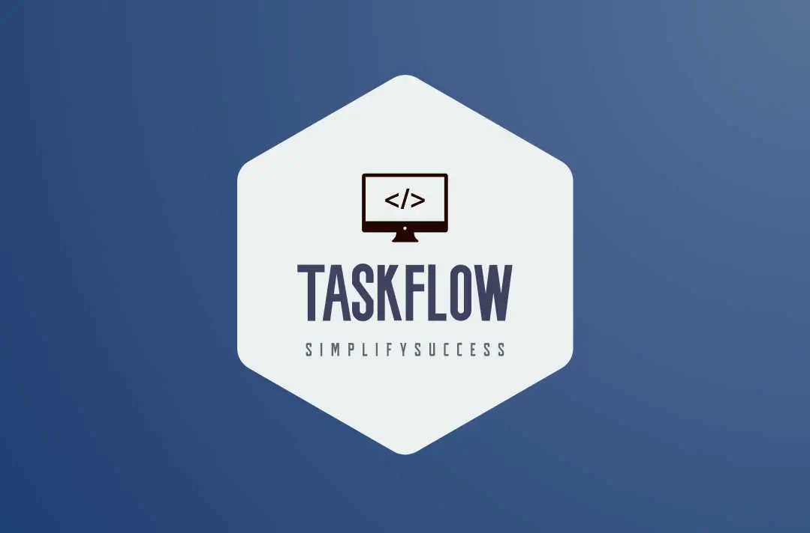

### Wireframing

The app consists of user account pages (login, logout, signup and social signup) and two extra pages for creating and editing Kanban boards. The main landing page of the site however, where users will likely spend 90%+ of their time, is where their current TaskFlow board with associated tasks are displayed. 

The design of this page (the basis for all other pages) was based off the wireframing done at the start of development process. Wireframing was done with [Balsamiq](https://balsamiq.com/) software.

#### Desktop

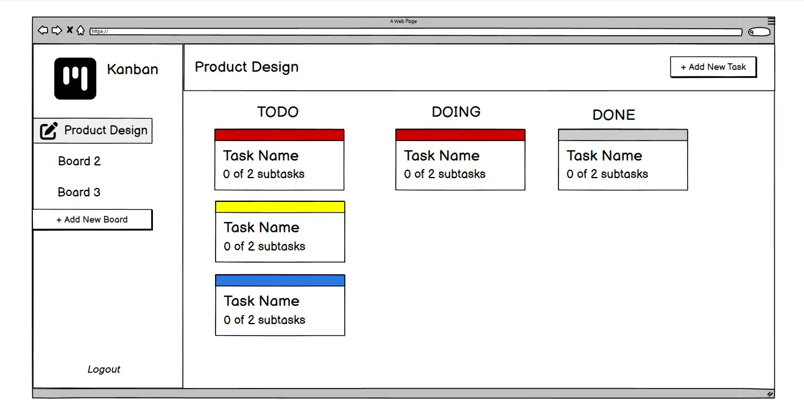

#### Mobile

*Wireframes for the App Mobile view & Task Creation Modal*

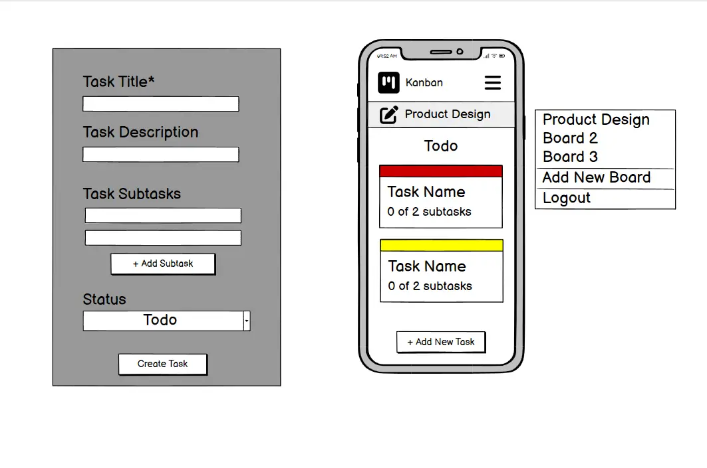

# Model Design And Relationships

For the software to properly track the relationships between boards, columns, labels, tasks and subtasks, the following Model design was planned and later implemented, with minor adjustments as the development process continued. The Entity Relationship Diagram (ERD) below (by [dbdiagram.io](https://dbdiagram.io/)) visually displays the database design. 

In this ERD, NN (Not Null) indicates required fields that the user cannot leave blank when creating a new instance of said Model.

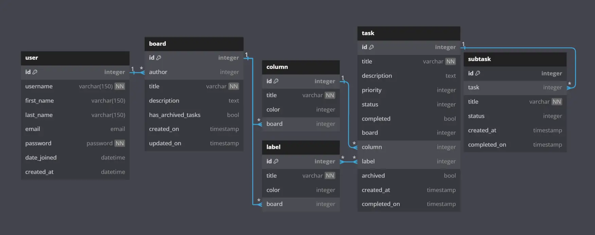

# Features

## Summary

-	Login, Logout or create an account using a personal password, or ‘sign in with Google’.
-	Create or edit Kanban boards with unique column names, colours, and labels.
-	Create new Tasks with labels, priority, status, and associated subtasks.
-	Update Tasks manually (through a form) or through drag and drop between columns (horizontally) or its position with a column (vertically).
-	Archive or delete tasks.
-	Search through existing tasks, including tasks that have been archived.
-	Toggle between a dark and light mode.
-	See board and tasks statistics such as the number of open/closed tasks on any board (app admin users only).

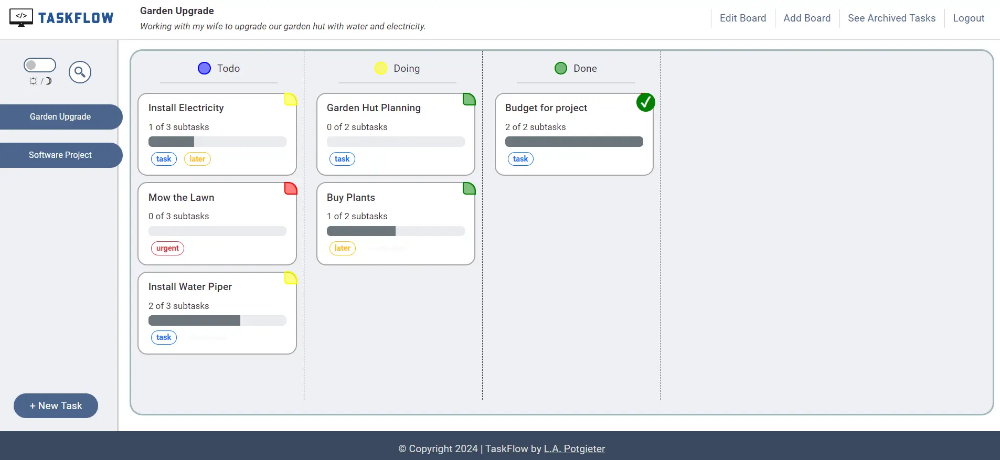

## Accounts

Upon opening the app, users are presented with a login screen and given the opportunity to create a new account if no current account is present. For both login and registration, a social login/signup option, via Google, is also available. 

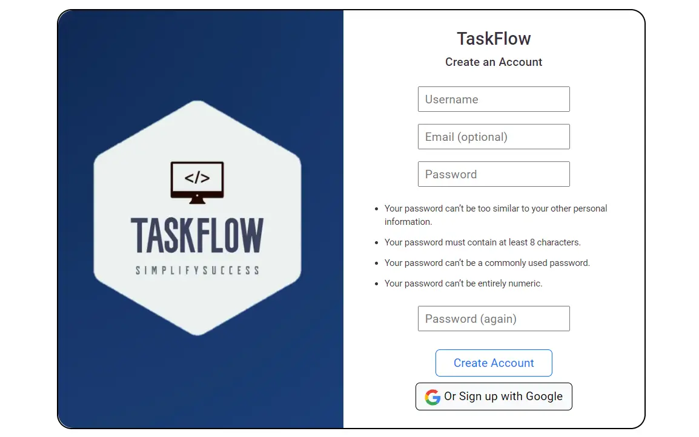

Each registered user then has access to the Kanban boards (and associated tasks) linked to his/her account. Newly created accounts do not start with a blank slate, but an initial Kanban board – with the classic three column layout and a sample task, is created to help get started using the app.

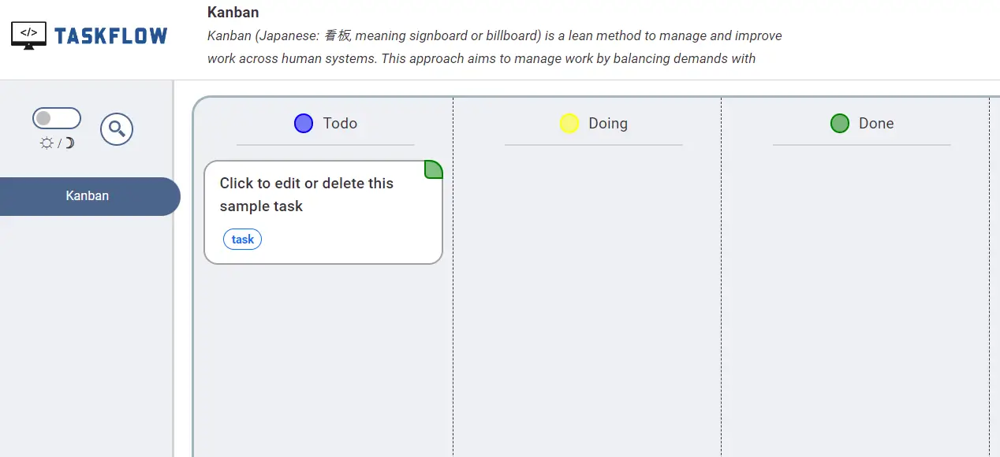

## Create New Board

Each registered user may have multiple different boards, each with its own set of columns, labels, and tasks (with subtasks). Upon creating a new board, users can choose the number of new columns (minimum 2), and labels, each with its own names and associated colour coding.

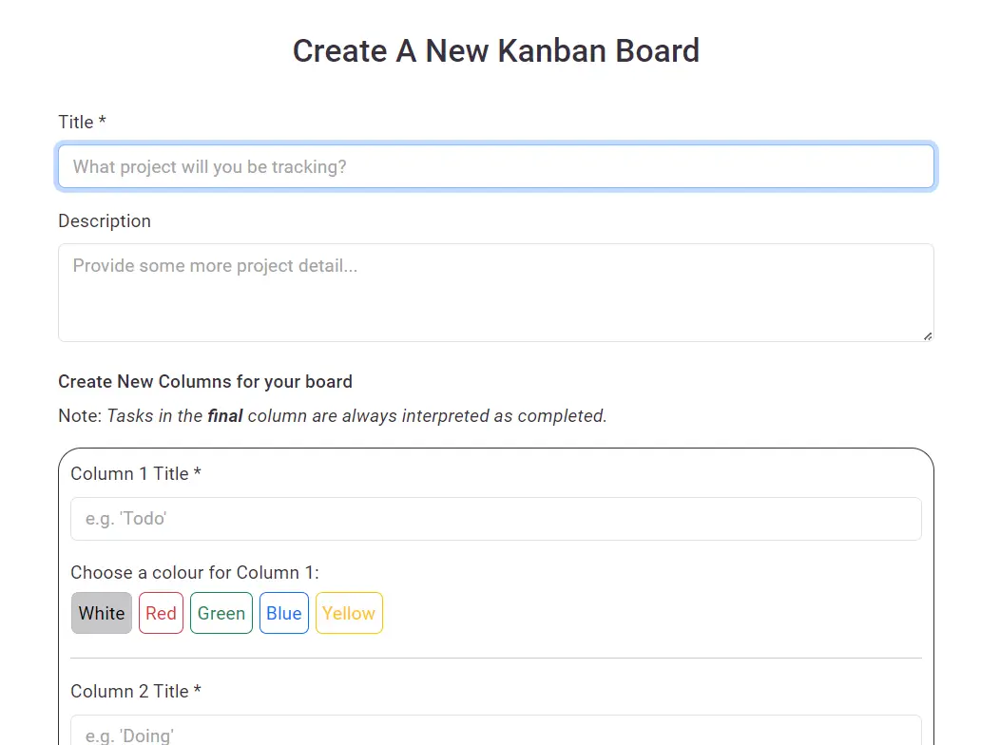

## Edit Existing Board

Users can edit boards they have already created (or the initial board created for them) by changing existing columns and labels, or by adding new ones. This could be helpful if a project’s requirements change and extra columns and/or labels are needed for the Kanban board to stay relevant. 

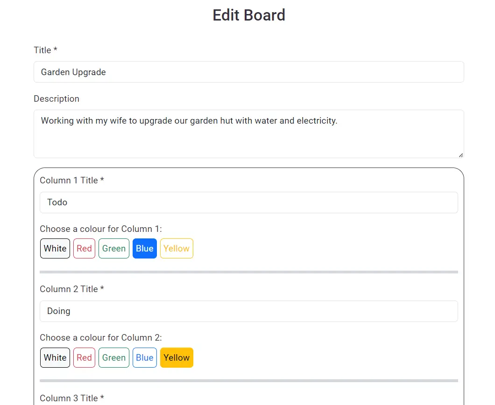

## Switch Between Boards

On the main page sideboard (or on smaller screens, in the navbar dropdown), users can switch between all their current Kanban Boards. Each board maintains its own set of columns, labels and tasks which makes it easy to track different personal or professional projects.

*The sideboard (or navbar on smaller screens) show the list of current boards, with new ones automatically added*

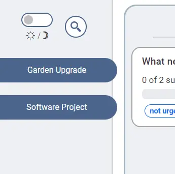

## Create New Tasks

The heart of any Kanban tool is the creating and tracking of tasks, and TaskFlow has provides users with a simple task creation tool where tasks can be named, described and prioritized (indicated with a colour coding system). During this process subtasks and task labels can also be added.

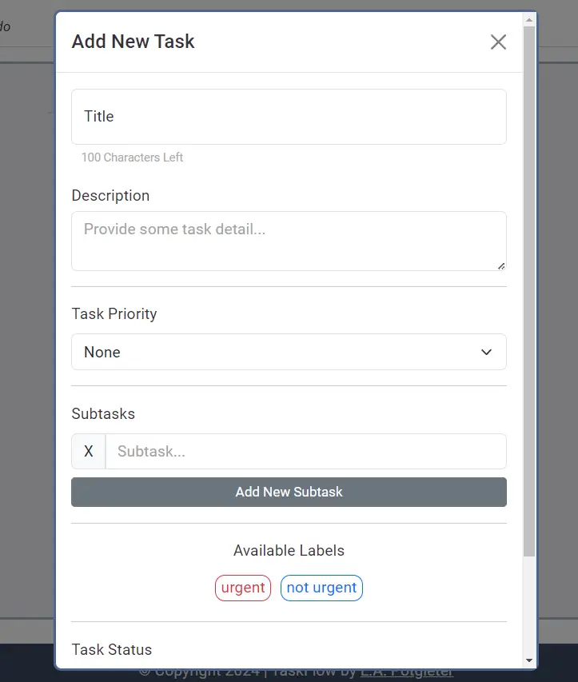

## Create Subtasks

Each new task that is created can include any number of subtasks and users can choose the number and titles of these subtasks.

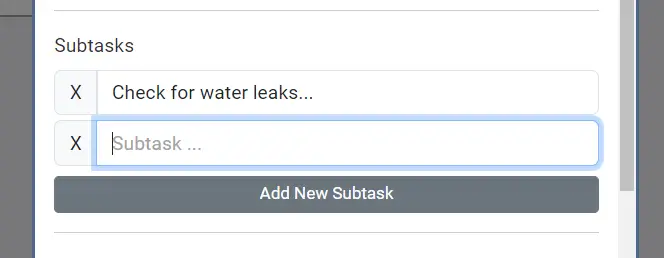

## Edit Existing Tasks

A Kanban board would not be much use without the ability to update task progress. This can be done either by clicking on the names of the existing tasks – in which case priority, labelling and status of a task can be changed. Or through using the mouse to drag a task into a new column. 

This automatically updates its status on the board. Tasks can also be manually ordered within a column (vertically, from top to bottom) to prioritise further. 


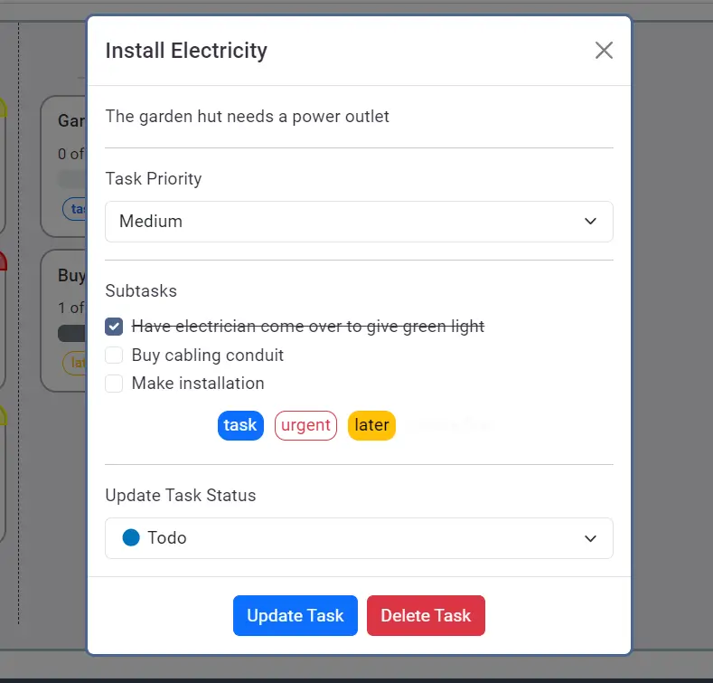

*On the edit task view, users can also check off completed subtasks.*

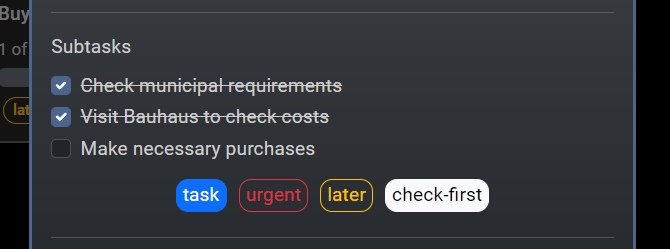

## Archive Tasks

The software design simplifies the completion of tasks by assuming that any task in the final board column (regardless of column name) is considered completed. Subtask completion is not required.

This is also made clear to the user when creating or editing boards. Tasks in the final column then get a visual update to indicate its completed status, and upon opening completed tasks users are presented with the option to archive a task. 

Archived tasks are separately available to view (and search through, see [below](#search-tasks)), but removed from the main board to prevent completed tasks from cluttering up the board.

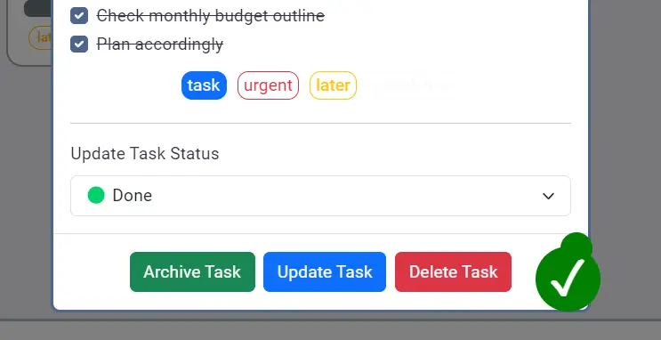

## View Archived Tasks

Once the first task has been completed and archived, a new navbar link is available through which users van view archived tasks when needed.

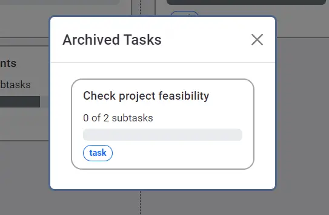


## Delete Tasks

If, for whatever reason, a user does not want to archive a task, but delete it, this is also an option. The delete option is available for any task, in any state, whether completed or not. 

Since this permanently removes the task, and associated subtasks, from the database, user confirmation is required before the actual task deletion takes place.

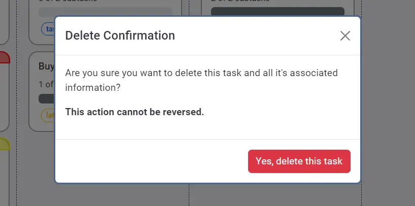


## Search Tasks

On any user board, a search functionality is available to search through the names and descriptions of all tasks currently on the board, including all archived tasks that are not visible on the board itself (but visible in a separate section). The search results are presented with tasks still in the columns they are currently sitting. As mentioned, archived tasks are included in the results, but clearly labelled.

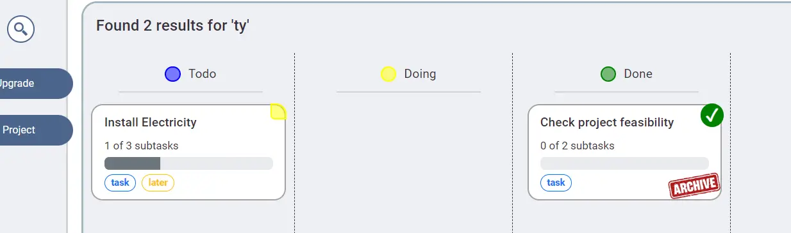


## Theme Toggle

A built in dark theme allows users to switch between a light and dark theme for the app. The light/dark toggle is located on the side board, next to the search button.

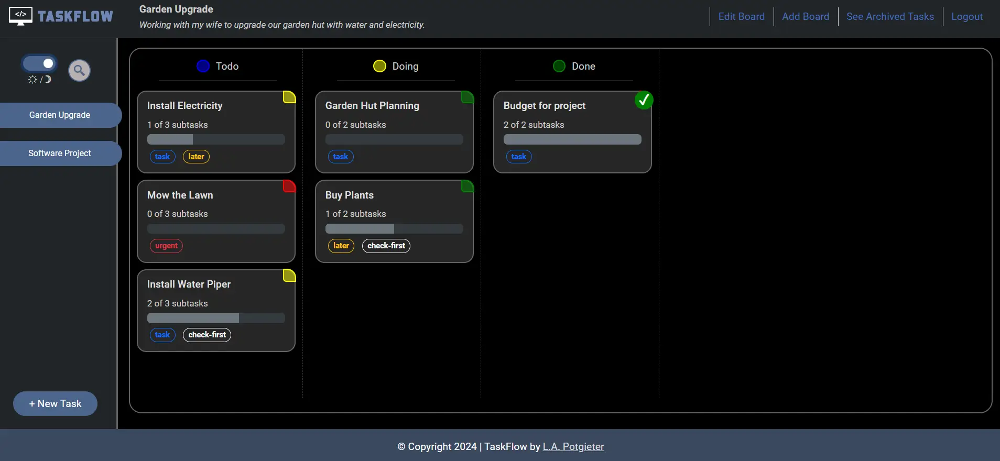

## Statistics

The app’s administrator may log into a customized admin page where statistics about the various users, boards, and tasks currently in the app database, is available. Admin users can, for example see the number of open, closed, and archived tasks currently on any given board. 

*The 'Board' section of the admin page shows open/closed tasks per board, with a link to all current open tasks*

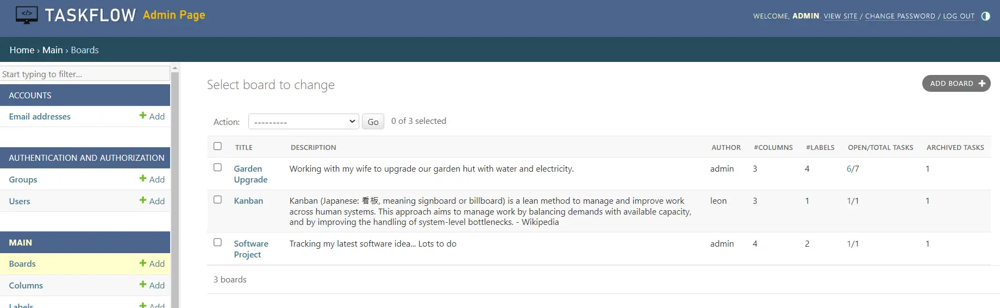

# Testing

## Manual Testing

<details>
<summary>Links & Modals</summary>
<br>

| Test | Result  |
|--|--|
| Clicking on the Logo opens the main landing page | Pass |
| Clicking on the Theme Toggle Button switch dark/light mode | Pass |
| Clicking on the Edit Board Link opens the Edit Board Link page | Pass |
| Clicking on the Logout Link returns the user to the account screen | Pass |
| Clicking on the Add Board Link opens the Add Board Link page | Pass |
| Clicking on the Archive Task Button archives the current Task | Pass |
| Clicking on the Delete Task Button opens the Delete Task modal | Pass |
| Clicking on the Board Switch Button switches the user to the selected board | Pass |
| Clicking on the Footer link open the authors GitHub Page | Pass |

</details>
<br>
<details>
<summary>App Core Functionality - Creating & Editing Boards</summary>
<br>

| Test | Result  |
|--|--|
| Users cannot enter invalid text for Board Names | Pass |
| Users cannot enter invalid text for Column Names | Pass |
| Users cannot enter invalid text for Label Names | Pass |
| Users cannot have duplicate Board Names | Pass |
| Users cannot enter invalid text for Column Names | Pass |
| User cannot delete existing Columns | Pass |
| Users cannot add new Columns with a duplicate name | Pass |
| Users cannot delete existing Labels | Pass |

</details>
<br>
<details>
<summary>App Core Functionality - Creating and Editing Tasks</summary>
<br>

| Test | Result  |
|--|--|
| Users cannot create tasks with titles longer than 100 characters | Pass |
| Users can create tasks without priority or subtasks, but not without status (column) | Pass |
| Tasks moved by drag and drop update their status | Pass |
| Tasks in the final column always receive a completed check | Pass |
| Tasks stay in their respective column after drag and drop | Pass |
| Tsks stay in their column vertical position after drag and drop | Pass |

</details>
<br>
<details>
<summary>App Core Functionality - Search</summary>
<br>

| Test | Result  |
|--|--|
| Search results are accurate | Pass |
| Archived tasks are included in the search results | Pass |

</details>

<br>
<details>
<summary>Testing For Responsiveness</summary>
<br>

| Test | Result |
|--|--|
|App displays correctly on screens between 320px & 479px |Pass|
|App displays correctly on screens between 480px & 767px |Pass|
|App displays correctly on screens between 768px & 1199px |Pass|
|App displays correctly on screens 1200px and larger |Pass|

</details>

<br>
<details>
<summary>Cross Browser Testing</summary>
<br>

| Browser | Resolution | Result | Issues |
|--|--|--|--|
|Chrome|1200px|Very Good|None|
|Edge|1200px|Very Good|None|
|Firefox|1200px|Very Good|None|
|Safari|768px|Good|None|


</details>

## Automated Testing

Nine automated tests were written and periodically ran during production. Tests can be found in these files:

<details>
<summary> Automated Testing </summary>
<br>

- main/test_views.py  
> Tests the apps primary view by creating new instances of the of the Board, Column, Label, Task and Subtask Model and then populating the landing page with these created instances. The test then checks the response to see if all created instances are present.

- task/test_views.py
> Tests the task creation process functionality, populating a reloaded version of the main landing page with a new instance of the Task model.

- main/test_models.py
> Test the creation of new instances of the Board, Column and Label models

-  task/test_models.py
> Test the creation of new instances of the Task and Subtask models

- main/test_forms.py
> Tests the functionality of the Board creation form.

-  task/test_forms.py
> Tests the functionality of the Task creation form.

</details>


## Validator Testing

- HTML | No errors were returned when passing through the official W3C validator. The results for the login page are below. The results for the main (index.html) page are also error free and can be checked manually.
  - [index.html HTML Validator Results](https://validator.w3.org/nu/?doc=https%3A%2F%2Ftask-flow-kanban-00e35d8a382c.herokuapp.com%2Faccounts%2Flogin%2F%3Fnext%3D%2F)

- CSS | No errors were returned when passing through the official W3C (Jigsaw) validator.
  - [style.css Jigsaw Validator Results](https://jigsaw.w3.org/css-validator/validator?uri=https%3A%2F%2Ftask-flow-kanban-00e35d8a382c.herokuapp.com%2Fstatic%2Fassets%2Fcss%2Fstyle.css&profile=css3svg&usermedium=all&warning=1&vextwarning=&lang=en)

- Javacscript | No errors were returned when passing the Javascript through the [JSHint](https://jshint.com/) validation tool.

- Python | No errors were found when passing the edited Django Python files through the [CI Python Linter](https://pep8ci.herokuapp.com/)

## Lighthouse Testing

The site was tested with Google Lighthouse using Chrome Developer Tools and the results for index.html are shown below.

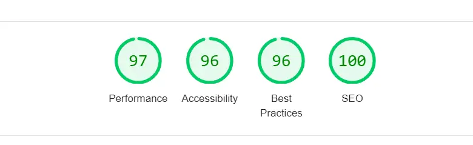


# Bugs

<details>
<summary> Bugs Details </summary>
<br>

 -	**Social Login:** The Django AllAuth library is supposed to simplify the implementation of social login within a Django project. Due to a bug in the latest version of the library, for some obscure reason, the Google login option was not recognised once the site was deployed to Heroku. After a few hours of debugging, I discovered [someone else]( https://forum.djangoproject.com/t/django-allauth-refuse-to-recognize-google-socialaccount/31106) who had the same problem and solved it by downgrading AllAuth to a previous version. Following this advice solved the problem and the Google social login feature now works on the deployed website.

-	**Drag and Drop Task Status Update:** After a user dragged a task to a new column, it would often revert to its old column upon page reload. To prevent this from happening I had to use JavaScript to manually update a task’s `column`field. This solved the problem.

-	**Drag and Drop Task vertical ordering:** To provide vertical ordering of tasks within a single column, I had to introduce an additional field to the Task model, which contained an integer of the current vertical location of a task within a column. This proved the simplest after trying different, much more complicated solutions.

-	**Dynamically generated HTML:** To allow users to add or remove labels and columns when creating or editing Kanban boards, I used JavaScript (jQuery) to dynamically generate the necessary HTML. Jquery also again removes this HTML is users end up not wanting additional columns or tasks. This took much trial, error and fine tuning to get just right so that the dynamically generated HTML looked visually correct and provided the correct functionality.

-	**Jquery Ajax:** In a previous [test project I built](https://github.com/leonp84/fm8-entertainment-web-app), I first encountered having to use asynchronous JavaScript and jQuery to send information from the front end to the Python back end. With this project I wanted to further refine that process by using JSON as the form of communication. For this I needed to do quite a bit of debugging to get the syntax for sending data asynchronously between the front end and back end, just right.

-	**Lighthouse (accessibility):** The initial lighthouse results for app accessibility were undesirable and I had to update the colouring of some labels to increase contrast and provide Aria labelling to some dynamically generated HTML elements. This improved the app score to its current high of above 90%.

-	**HTML Validation (duplicate IDs):** When I first ran the app through the HTML validation tool, I discovered that there were many duplicate ID's which was being created by the dynamically generated HTML. I had to manually go through each of these and update the ID’s of the elements using the Django `forloop.counter` to create unique ID’s when generating similar HTML elements. This solved the problem.

-	**JavaScript Validation:** The initial JavaScript validation showed many missing semicolons and some undeclared variables which I then fixed.

-	**Django URL paths:** During project development I had quite some trouble getting Django to recognise the different URL's when it was being requested with parameters. I was able to solve much of this using the Django `re_path` command which I learned about from the documentation.

-	**Testing: Client login:** When writing unit tests, I kept running into HTML redirect problems which meant that the tests that required user login did not work. I was able to solve this using the Django test client login feature.

</details>
<br>

# Deployment

These are the steps I followed to deploy the project to Heroku:

<details>
<summary> Deployment Steps </summary>
<br>

1.  I logged in to my existing Heroku account.

2.	I clicked New and created a new app on the dashboard.

3.	I entered a unique name ('taskflow-kanban'), selected the region (in my case, Europe), and clicked Create app.

4.	Within the created app, I selected the tab, Settings.

5.	At the Config Vars section, I clicked Reveal Config Vars.

6.	I added Config Vars (with their associated values, that I got from env.py in my IDE) for the following keys: 
- `SECRET_KEY`
- `DATABASE_URL`

`DATABASE_URL` is provided by [neon.tech](https://neon.tech/) when signing up for a free database with them. On their console dashboard the necessary instructions for connecting their database to your django project should be followed exactly. As part of this process the following commands are needed to install additional libraries:

`pip3 install dj_databse_url`
`pip3 install psycopg2-binary`

7.	Back in the Integrated Development Environment, I created a list of requirements by typing pip3 freeze > requirements.txt into the terminal.

8. In my Django `settings.py` file I updated/added the following settings, which are all related to deployment to Heroku:

```
DEBUG = False

ALLOWED_HOSTS = [
    ".herokuapp.com",
]

CSRF_TRUSTED_ORIGINS = [
    'https://*.herokuapp.io',
]

DATABASES = {
    'default': dj_database_url.parse(os.environ.get("DATABASE_URL"))
}

STATIC_URL = 'static/'
STATICFILES_DIRS = [os.path.join(BASE_DIR, 'static'), ]
STATIC_ROOT = os.path.join(BASE_DIR, 'staticfiles')
```

9. I made sure to have static files (stylesheets, scripts, images etc.) available for Heroku by using the following command in the Command Line: `python manage.py collectstatic`

10. I created a Procfile for Heroku in my apps root directory. This file is simply called `Procfile` and contains the following line:

`web: gunicorn taskflow.wsgi`

11.	I now ensured that a working version of my code was committed and pushed to GitHub.

12.	Now on Heroku again, I navigated to the Deploy tab.

13.	I selected GitHub as the deployment method and connected to GitHub.

14.	I searched for the repository name of the project (in my case: `code-institute-project-4`) and clicked connect.

15.	I enabled automatic deploys to deploy each time new code was pushed to the repository (optional).

16.	I then finally clicked Deploy Branch to deploy the project.

</details>
<br>

# Links

Deployed Website: https://task-flow-kanban-00e35d8a382c.herokuapp.com/<br>
GitHub Repository: https://github.com/leonp84/code-institute-project-4/

# Credits

<details>
<summary> Content and Media Credits </summary>

## Content

- For help with implementing drag and drop, Kyle from [WebDevSimplified](https://www.youtube.com/@WebDevSimplified) proved tremendously helpful.
- For help with the Django getlist function, used to import multiple items from forms when they have the same `name` attribute: [Eric Saupe's Blog](https://ericsaupe.netlify.app/get-list-from-post-data-django/)
- For help with undersatnding Django many-to-many relationships within a database: [Sankalp Jonna's Dev Blog](https://www.sankalpjonna.com/learn-django/the-right-way-to-use-a-manytomanyfield-in-django)
- For help with with updating the subtasks progress bar on index.html I used [Django mathfilters library](https://pypi.org/project/django-mathfilters/)
- For help with fine tuning the sending of data via Jquery Ajax: [testdriven.io](https://testdriven.io/blog/django-ajax-xhr/)
- For help in removing whitespace from items retrieved via Jquery: [Stack Overflow Question](https://stackoverflow.com/questions/6623231/remove-all-white-spaces-from-text)
- For help with advanced Django template filtering: [Stack Overflow](https://stackoverflow.com/questions/739776/how-do-i-do-an-or-filter-in-a-django-query)
- The official [Django documentation](https://docs.djangoproject.com/en/5.0/) helped a lot with understanding the `re_path` and `Client()` functionality.
- Django docs for help with client login during testing
- For help with optimising Django database queries to reduce loading times: [Sebastian Karasiewicz from SoftKraft](https://www.softkraft.co/django-speed-up-queries/)

## Media
- UI design inspired by a FrontEndMentor project I build: [Entertainment Web App](https://github.com/leonp84/fm8-entertainment-web-app)
- Site Logo designed with [Looka](https://www.looka.com)

</details>
